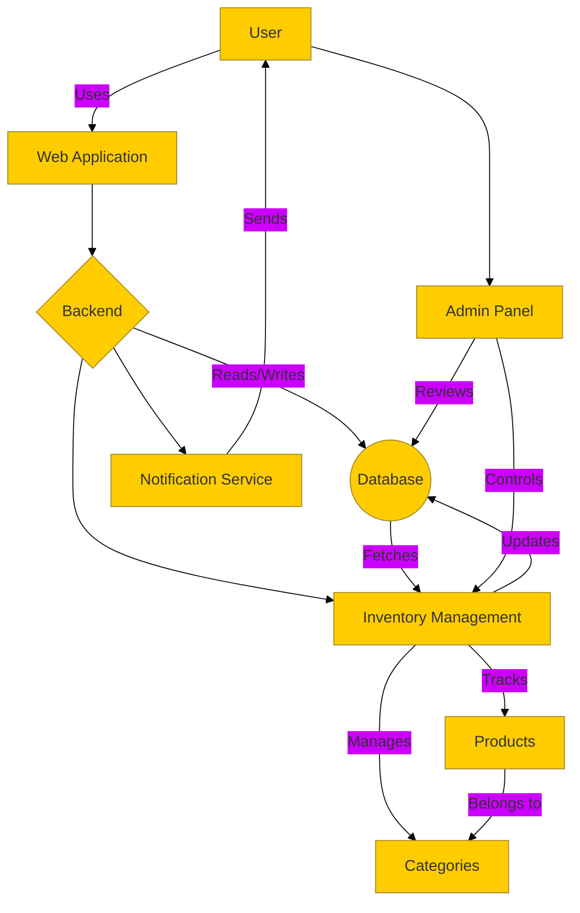

```mermaid
%%{init: {"theme": "base", "themeVariables": {"primaryColor": "#ffcc00"}}}%%

graph TD;
    A[User] -->|Uses| B[Web Application]
    B --> C{Backend}
    C -->|Reads/Writes| D((Database))
    C --> E[Notification Service]
    C --> F[Inventory Management]
    D -->|Fetches| F
    E -->|Sends| A
    F -->|Updates| D
    F -->|Tracks| G[Products]
    F -->|Manages| H[Categories]
    G -->|Belongs to| H
    A --> I[Admin Panel]
    I -->|Controls| F
    I -->|Reviews| D
```